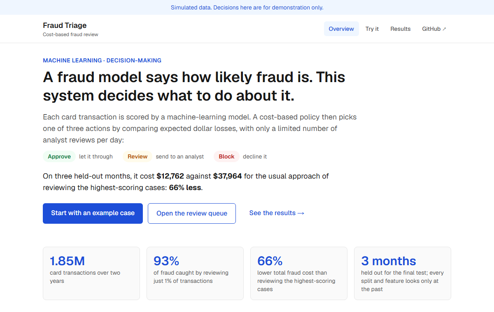
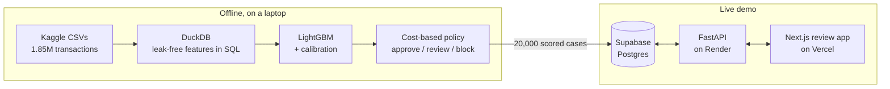
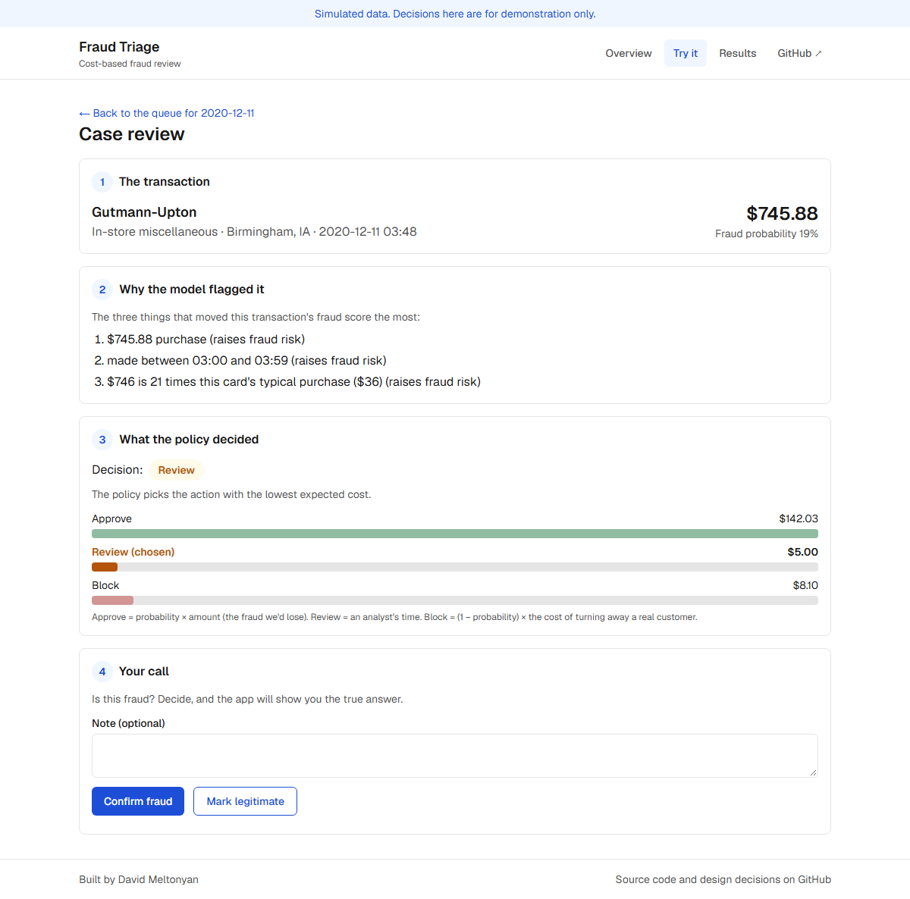
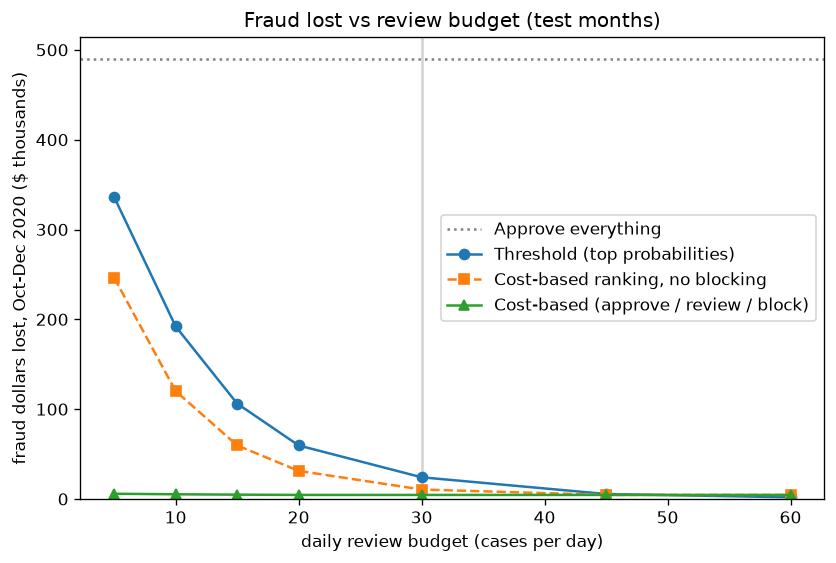
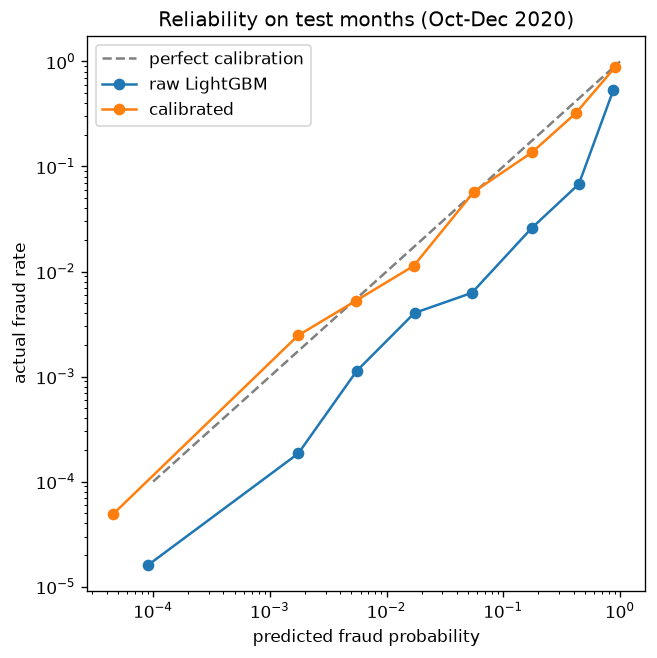

# Fraud Triage

A fraud detection system that turns a model's fraud probability into a decision (approve, send to an analyst, or block) by comparing expected dollar costs under a limited daily review budget.

**Result:** on three held-out months of simulated card transactions, with analysts limited to 30 reviews a day, the cost-based policy cost **$12,762** in total against **$37,964** for the usual approach of reviewing the highest-probability transactions.

**Live demo:** _link coming soon_ · **Video walkthrough:** _link coming soon_ · **Decision log:** [DECISIONS.md](DECISIONS.md)



## Why this matters

Fraud models are easy to train and hard to act on. Fraud is rare (about 1 in 190 transactions here), so a model that never flags anything is 99.5% accurate and useless. And analysts can only check a few cases a day, so the real question isn't "is this fraud?" but "which cases deserve a person's time?"

Most systems answer that by reviewing the highest-scoring transactions. That spends review slots on small purchases that happen to look suspicious. This project ranks cases by expected dollars instead, and blocks near-certain fraud without using a review at all.

## How it works



1. **Features.** For every transaction: the card's transactions in the previous hour and day, the amount compared with the card's usual spend, hour, weekday, merchant category, and distance from home. Each history feature only looks at earlier transactions.
2. **Model.** LightGBM, trained on January 2019 to June 2020. Its scores are calibrated on a separate month, so a score of 30% means about 3 in 10 such transactions really are fraud.
3. **Policy.** For each transaction, compare three expected costs: approve = probability × amount, review = $5 of analyst time, block = (1 − probability) × $10 for turning away a real customer. Pick the cheapest. Each day, the 30 review slots go to the cases where a review saves the most.
4. **Review app.** Analysts see each day's queue, the three reasons behind each score, and the cost of each action, then mark the case as fraud or legitimate.



## Results

Test months October to December 2020: 281,521 transactions, 936 frauds worth $489,894. Every policy gets the same 30 reviews a day.

| Policy | Fraud lost | Reviews | Legitimate customers declined | Total cost |
|---|---|---|---|---|
| Approve everything | $489,894 | 0 | 0 | $489,894 |
| Review the highest probabilities | $24,164 | 2,760 | 0 | $37,964 |
| Review the highest expected dollars (no blocking) | $10,563 | 2,052 | 0 | $20,823 |
| **Cost-based: approve, review or block** | **$4,527** | **1,419** | **114** | **$12,762** |

Total cost = fraud lost + $5 per review + $10 per legitimate customer declined.

Ranking by expected dollars alone, with the same budget and no blocking, cuts fraud lost by more than half: the probability-ranked policy spent over a third of its review slots on transactions under $50. Blocking then catches near-certain fraud without using a review slot.

The model: LightGBM reaches a test PR-AUC of 0.838 against 0.376 for a logistic regression baseline, and reviewing the riskiest 1% of transactions catches 93.3% of fraud against 59.8%.

| Fraud lost as the review budget changes | Calibration on the test months |
|---|---|
|  |  |

## Key decisions

The full log, with the reasoning for each, is in [DECISIONS.md](DECISIONS.md).

1. **Time-based splits only.** Train on Jan 2019 to Jun 2020, tune on Jul to Aug, calibrate on Sep, test on Oct to Dec. A random split would let the model learn from the future.
2. **Leak-free features, with a test that proves it.** Every history window ends one microsecond before the current transaction, so it never sees itself or a same-second transaction. A test adds a later transaction and checks that no earlier feature changes.
3. **Calibrated probabilities.** The policy multiplies probability by amount, so probabilities must match real fraud rates. Training weighted fraud 13 times, which made raw scores about twice too high; Platt scaling on a held-out month fixes that.
4. **Rank reviews by expected dollars, not probability.** Probability ranking wastes slots on small purchases because the model also flags small frauds.
5. **Score offline, serve precomputed results.** The deployed API never loads LightGBM or SHAP, so it fits on free hosting. A test checks that production mode never imports them.

## Assumptions and limitations

- **Simulated data.** The [Sparkov dataset](https://www.kaggle.com/datasets/kartik2112/fraud-detection) is generated, so these results say nothing about real banks. It also never produces a fraud above $1,376, so the model learned that very large purchases are safe; real fraudsters would exploit that.
- **Cost assumptions.** $5 per review and $10 per wrongly declined customer are guesses, set in `config.yaml`. The conclusion holds when the review cost is halved or doubled, and when the decline cost is raised to $50 or $100, though blocking becomes much more cautious.
- **Simplifications.** Analysts are assumed never to make mistakes, an approved fraud loses its full amount, and the daily budget is applied with the whole day in view, as if analysts worked through the queue at the end of the day.
- **Batch scoring.** The API scores transactions that are already in the database. Scoring a brand-new transaction live would need a store of each card's recent activity.
- **Free hosting.** The demo API sleeps when idle, so the first visit can take up to a minute.

## How to run it locally

You need Python 3.14 and, for the web app, Node.js 20 or newer. Commands are for Windows PowerShell; on macOS or Linux use `.venv/bin/python` instead of `.venv\Scripts\python`.

**1. Set up Python and get the data**

```
py -3.14 -m venv .venv
.venv\Scripts\python -m pip install -r requirements.txt
```

Download the [Kaggle dataset](https://www.kaggle.com/datasets/kartik2112/fraud-detection) (free account needed) and put `fraudTrain.csv` and `fraudTest.csv` in a `data` folder at the project root.

**2. Build everything** (about a minute in total)

```
.venv\Scripts\python -m src.load        # CSVs into data/fraud.duckdb
.venv\Scripts\python -m src.features    # leak-free features
.venv\Scripts\python -m src.train       # baseline, LightGBM, calibration, reports/metrics.json
.venv\Scripts\python -m src.compare     # policy comparison, reports/policy_results.json
.venv\Scripts\python -m src.explain     # example explanations, SHAP summary plot
.venv\Scripts\python -m pytest          # tests
```

**3. Try the API locally**, scoring live with the model:

```
.venv\Scripts\python -m uvicorn src.api.main:app --reload
```

Then open http://127.0.0.1:8000/docs.

**4. Run the full demo** (needs a free [Supabase](https://supabase.com) project)

1. Copy `.env.example` to `.env` and set `DATABASE_URL` to your Supabase session pooler connection string.
2. Load the demo data: `.venv\Scripts\python -m src.export_demo --upload`
3. Start the API in demo mode: `$env:DATA_BACKEND="postgres"; .venv\Scripts\python -m uvicorn src.api.main:app --port 8000`
4. In a second terminal:

```
cd web
npm install
copy .env.example .env.local
npm run dev
```

Then open http://localhost:3000. Browser tests: `npx playwright install chromium`, then `npm run test:e2e`.

Deploying to Render and Vercel is covered step by step in [DEPLOY.md](DEPLOY.md).

## Project layout

```
src/            Python: loading, features, training, calibration, costs, policy, explanations
src/api/        FastAPI: local mode (live scoring) and demo mode (Supabase)
tests/          pytest tests
notebooks/      exploratory analysis
reports/        metrics, policy results and charts
sql/            Postgres schema for the demo
web/            Next.js review app, with Playwright tests in web/e2e
config.yaml     every cost assumption, threshold and split date
DECISIONS.md    what was decided and why
```

## What I'd do next

- **Score live transactions** with a small store of each card's recent activity, so the API can take a brand-new transaction instead of an ID.
- **Decide in real time.** Replace the end-of-day review budget with a threshold learned from previous days.
- **Better cost estimates.** A false decline costs more for a loyal customer than a new one; the $10 flat cost is the assumption that most changes behaviour.
- **Monitor drift.** Track the score distribution and fraud caught week by week, and retrain when they shift.

---

Built by David Meltonyan.
